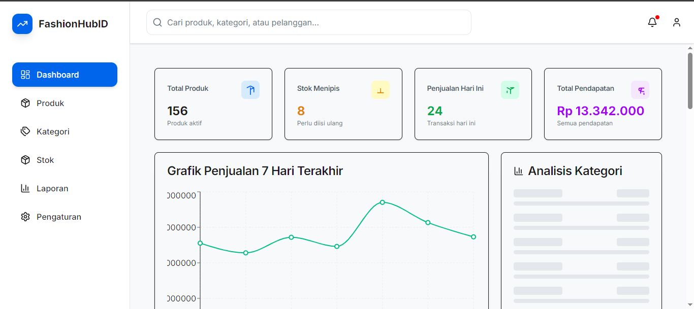
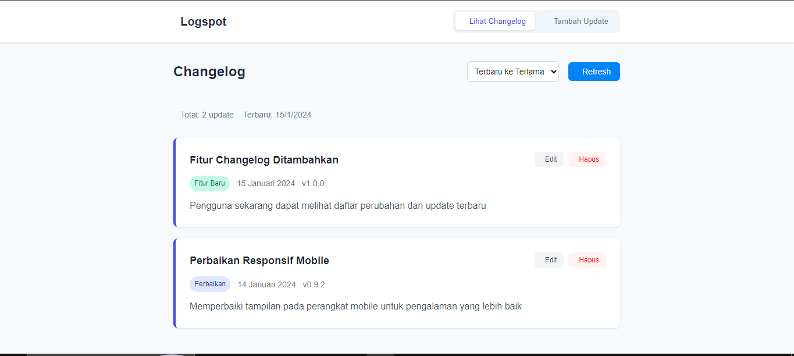
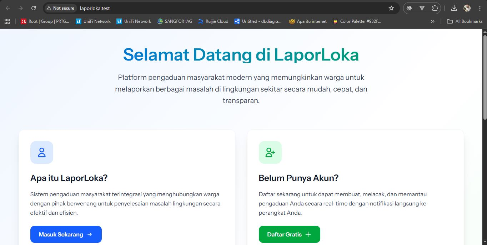

# Hi 👋, I'm Audyari Wiyono

### A Network Engineer Architecting the Future as a Full Stack Developer

  

---

## 🚀 My Story: From Infrastructure to Interface

With over 15 years in IT infrastructure and network security, I've spent a career building the robust foundations that power technology. Now, I'm channeling that deep-rooted expertise into crafting modern, secure, and scalable web applications from the ground up. My unique perspective allows me to not only write clean code but also understand the entire system it runs on—from the database query to the network packet.

---

## 🔐 My Infrastructure & Security Edge

My transition isn't just about learning new languages; it's about applying a wealth of systems knowledge to development. This means building applications that are:

- 🛡️ **Secure by Design:** Built with a deep understanding of network security, common vulnerabilities, and best practices from day one.
- ⚙️ **Operationally Excellent:** Designed for easy deployment, monitoring, and maintenance, leveraging my extensive DevOps and cloud experience.
- 🌐 **Built for Scale:** Focused on performance and scalability, ensuring applications can handle growth without compromising on speed or reliability.

---

## ⭐ Featured Projects

### 🎯 [Portfolio Website](https://github.com/Audyari/portfolio-website)

  

**Problem:** Needed a professional, fast, and SEO-optimized platform to showcase my projects and transition journey.

**Solution:** Developed a modern, responsive portfolio using Next.js and Tailwind CSS, achieving high Lighthouse scores and a seamless user experience.

**Tech Stack:**

  
  

[🚀 Live Demo](https://portfolio-website-ehfhhgtcn-audyari-ws-projects.vercel.app/) | [📁 Source Code](https://github.com/Audyari/portfolio-website)

---

### 🛩️ [SkyPart Solutions](https://github.com/Audyari/astro-supabase-starter)

**Problem:** Small aviation businesses struggle to find niche aircraft spare parts through slow, clunky e-commerce sites.

**Solution:** Architected a lightning-fast, SEO-first e-commerce platform with Astro.js and Supabase, dramatically improving page load times and search visibility.

**Tech Stack:**

  
  

[🚀 Live Demo](https://skypartsolutions.netlify.app/) | [📁 Source Code](https://github.com/Audyari/astro-supabase-starter)

---

### 👗 [FashionHub ID](https://github.com/Audyari/fashion-retail-management)

  

**Problem:** Small fashion retailers need an intuitive system to manage inventory and sales without expensive enterprise software.

**Solution:** Built a comprehensive retail management dashboard with Next.js, enabling real-time inventory tracking, sales analytics, and product management.

**Tech Stack:**

  
  

[🚀 Live Demo](https://fashion-hub-id.vercel.app/) | [📁 Source Code](https://github.com/Audyari/fashion-retail-management)

---

### 📰 [LOGSPOT](https://github.com/Audyari/logspot)

  

**Problem:** Teams need a simple, beautiful way to communicate product updates and changelogs to their users.

**Solution:** Created a clean and focused changelog application using Vue 3, designed for readability and easy content management.

**Tech Stack:**

  

[🚀 Live Demo](https://logspot-gamma.vercel.app/) | [📁 Source Code](https://github.com/Audyari/logspot)

---

### 🏢 [FashionHub ID Company Profile & Product Catalog](https://company-profile-katalog.vercel.app/)

  

**Problem:** Small fashion retailers need an intuitive way to showcase their products and company profile.

**Solution:** Developed a comprehensive company profile and product catalog using Next.js, enabling a seamless and user-friendly experience for customers.

**Tech Stack:**

  
  

[🚀 Live Demo](https://company-profile-katalog.vercel.app/)

---

### 📍 [LaporLoka](https://github.com/Audyari/laporloka)

  

**Description:** LaporLoka adalah sistem pelaporan berbasis lokasi yang memungkinkan pengguna untuk mengirimkan, melacak, dan mengelola laporan dengan informasi geografis.

**Tech Stack:**
- **Backend:** Laravel 12.0 (PHP 8.2+)
- **Frontend:** Livewire dengan komponen Volt dan Flux

[📁 Source Code](https://github.com/Audyari/laporloka)

---

## 🛠️ Technical Arsenal

### Core Competencies (Frontend & Ecosystem)

  
  
  
  
  
  

### Actively Learning & Expanding Into

  
  
  
  
  
  

### Infrastructure & Operations

  
  
  
  
  

---

## 📊 GitHub Activity & Stats

  

  

---

## 🎯 2025 Growth Roadmap

- [ ] **Build a production-ready Rust SaaS** - A full-stack application with a Rust backend (Actix/Axum) and a Vue/React frontend
- [ ] **Master WebAssembly** - Develop a high-performance browser application using Rust and WASM
- [ ] **Contribute to Open Source** - Actively contribute to a Rust or Vue.js ecosystem project
- [ ] **Deepen Cloud Expertise** - Achieve an advanced cloud architecture certification (e.g., AWS Solutions Architect Professional)
- [ ] **Share My Journey** - Launch a technical blog detailing my transition from network engineering to full-stack development

---

## 🌐 Let's Connect & Collaborate

  
  

  <i>💡 I'm always open to discussing web development, challenging projects, and freelance opportunities.</i>
   
  <i>🤝 Let's build something robust, secure, and remarkable together!</i>

---

  

